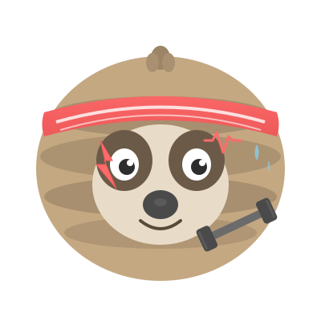

<p align="center">
  
</p>

# No Days Off App

A comprehensive fitness management application built with modern .NET technologies and Domain-Driven Design principles.

## Technology Stack

- **Backend**: ASP.NET Core (.NET 9.0)
- **Database**: SQL Server with Entity Framework Core 9.0
- **Architecture**: Domain-Driven Design (DDD) with CQRS pattern using MediatR
- **API Documentation**: Swagger/OpenAPI
- **Testing**: xUnit with FluentAssertions and code coverage

## Project Structure

The solution follows a clean, layered architecture with three main projects:

### Core Projects

- **[NoDaysOff.Core](src/NoDaysOff.Core/)** - Domain layer containing business logic, aggregates, value objects, and domain events
- **[NoDaysOff.Infrastructure](src/NoDaysOff.Infrastructure/)** - Data access layer with Entity Framework Core DbContext and configurations
- **[NoDaysOff.Api](src/NoDaysOff.Api/)** - REST API layer with controllers, MediatR commands/queries, and DTOs

### Test Projects

- **[NoDaysOff.Core.Tests](tests/NoDaysOff.Core.Tests/)** - Unit tests for domain models
- **[NoDaysOff.Api.Tests](tests/NoDaysOff.Api.Tests/)** - API integration tests
- **[NoDaysOff.Infrastructure.Tests](tests/NoDaysOff.Infrastructure.Tests/)** - Data access tests

## Features

The application implements 14 bounded contexts for comprehensive fitness management:

1. **Athlete Management** - User profiles with fitness tracking and progress monitoring
2. **Exercise Management** - Exercise definitions with sets, reps, and weight configurations
3. **Workout Management** - Complete workout sessions and tracking
4. **Scheduled Exercises** - Exercise planning within workout routines
5. **Day Management** - Workout day organization (Push Day, Pull Day, Leg Day, etc.)
6. **Body Part Management** - Body part categorization (Chest, Back, Legs, Arms, etc.)
7. **Dashboard Management** - Customizable user dashboards
8. **Tile Management** - Dashboard widget configuration
9. **Video Content** - Exercise tutorial and instructional videos
10. **Conversations** - User messaging and communication
11. **Digital Assets** - File and media management
12. **Profile Management** - User profile administration
13. **Tenant Management** - Multi-tenancy support
14. **Authentication & Authorization** (planned)

## Key Architectural Features

- **Multi-tenancy Support** - Built-in tenant isolation for SaaS deployment
- **Soft Delete** - All entities support soft deletion with IsDeleted flag
- **Audit Tracking** - Automatic tracking of creation and modification timestamps with user attribution
- **Domain Events** - Event-driven architecture for cross-aggregate communication
- **Value Objects** - Rich domain modeling with custom value types (Weight, Duration, etc.)
- **CQRS Pattern** - Command and Query separation using MediatR
- **No Repository Pattern** - Direct DbContext interface for simplified data access

## Getting Started

### Prerequisites

- .NET 9.0 SDK
- SQL Server (LocalDB, Express, or full version)
- Visual Studio 2022 or VS Code

### Running the Application

1. Clone the repository
2. Update the connection string in [src/NoDaysOff.Api/appsettings.Development.json](src/NoDaysOff.Api/appsettings.Development.json)
3. Run database migrations (if configured)
4. Start the API project:
   ```bash
   dotnet run --project src/NoDaysOff.Api
   ```
5. Navigate to `https://localhost:<port>/swagger` to explore the API

### Running Tests

```bash
dotnet test
```

## Documentation

Comprehensive documentation is available in the [docs](docs/) directory:

- **[system.md](docs/system.md)** - Technical specifications and coding standards
- **[core-domain.md](docs/core-domain.md)** - DDD architecture and domain model
- **[athlete-management.md](docs/athlete-management.md)** - Athlete features
- **[exercise-management.md](docs/exercise-management.md)** - Exercise definitions
- **[workout-scheduling.md](docs/workout-scheduling.md)** - Workout planning
- **[dashboard-management.md](docs/dashboard-management.md)** - Dashboard configuration
- **[messaging.md](docs/messaging.md)** - User communication
- **[video-content.md](docs/video-content.md)** - Video management

## Give a Star! :star:

If you like or are using this project to learn or start your solution, please give it a star. Thanks!
