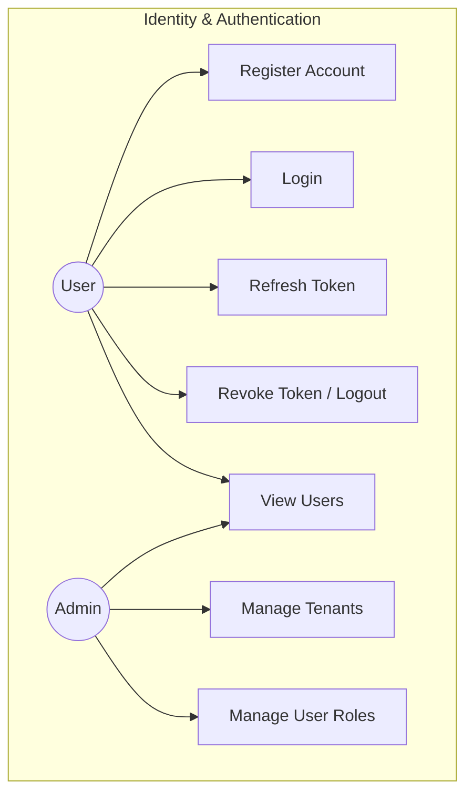
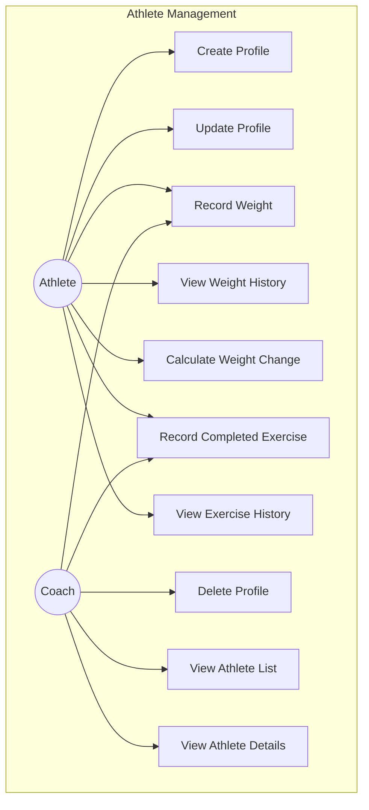
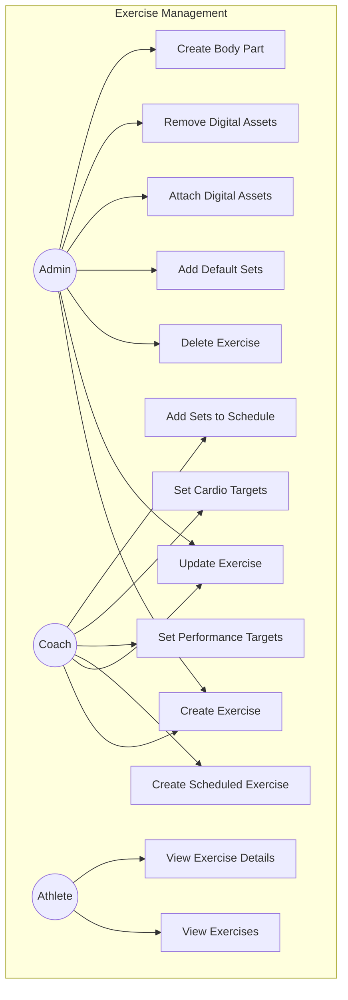
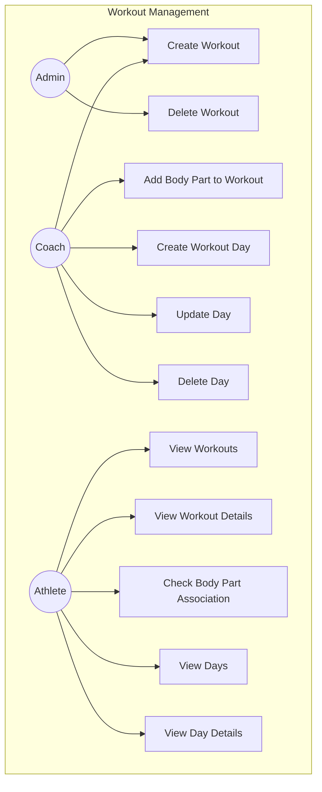
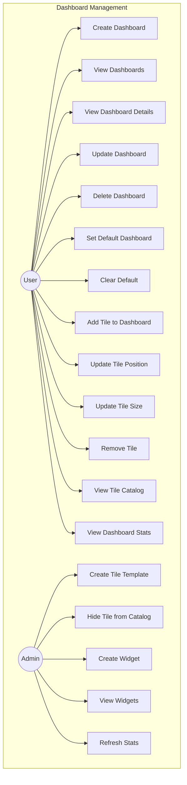
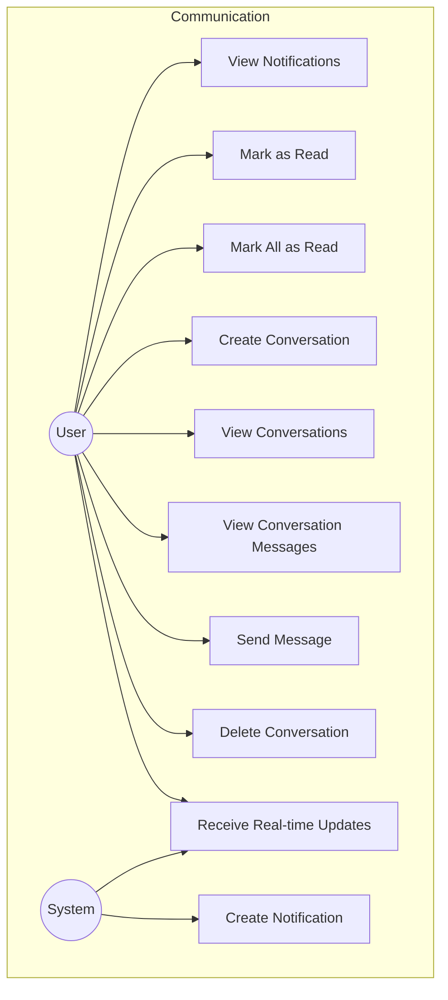
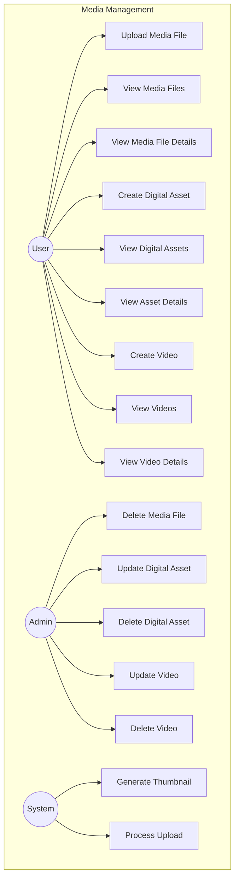
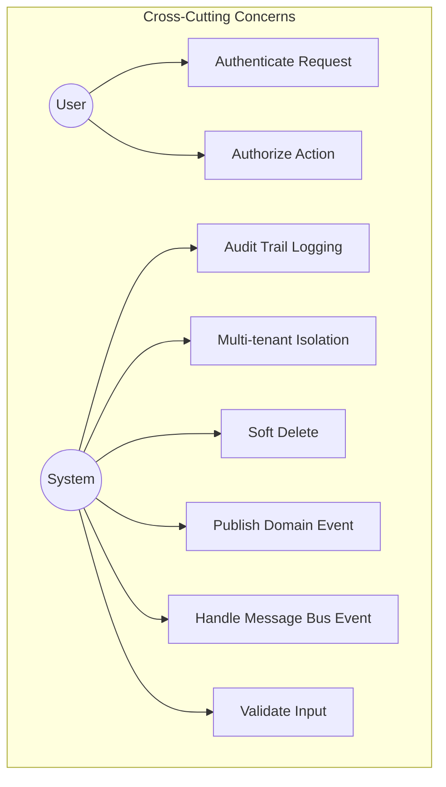

# Use Case Diagrams

This document contains use case diagrams for all behaviors in the No Days Off application, organized by microservice/module.

---

## 1. Identity & Authentication Use Cases

### Identity Use Case Descriptions

| Use Case | Actor | Description | Preconditions | Postconditions |
|----------|-------|-------------|---------------|----------------|
| UC1: Register Account | User | Create new user account | None | Account created, verification email sent |
| UC2: Login | User | Authenticate to system | Account exists, verified | Access token received |
| UC3: Refresh Token | User | Renew expired access token | Valid refresh token | New token pair received |
| UC4: Revoke Token | User | Logout and invalidate tokens | Authenticated | Tokens invalidated |
| UC5: Manage Tenants | Admin | Create/view tenants | System admin role | Tenant created/listed |
| UC6: View Users | User/Admin | List system users | Authenticated | User list displayed |
| UC7: Manage User Roles | Admin | Assign/remove user roles | Admin role | Roles updated |

---

## 2. Athlete Management Use Cases

### Athlete Use Case Descriptions

| Use Case | Actor | Description | Preconditions | Postconditions |
|----------|-------|-------------|---------------|----------------|
| UC1: Create Profile | Athlete | Create athlete profile | Authenticated user | Profile created, event published |
| UC2: Update Profile | Athlete | Modify profile info | Profile exists | Profile updated |
| UC3: Delete Profile | Coach | Remove athlete (soft delete) | Admin/coach role | Profile marked deleted |
| UC4: Record Weight | Athlete/Coach | Log weight measurement | Profile exists | Weight recorded, current weight updated |
| UC5: View Weight History | Athlete | View past weight records | Profile exists | History displayed |
| UC6: Calculate Weight Change | Athlete | Analyze weight trend | Multiple weights recorded | Change calculated |
| UC7: Record Completed Exercise | Athlete/Coach | Log exercise completion | Profile exists, exercise scheduled | Exercise logged |
| UC8: View Exercise History | Athlete | View past exercises | Profile exists | History displayed |
| UC9: View Athlete List | Coach | List all athletes | Coach role | Athletes listed |
| UC10: View Athlete Details | Coach | View specific athlete | Coach role | Details displayed |

---

## 3. Exercise Management Use Cases

### Exercise Use Case Descriptions

| Use Case | Actor | Description | Preconditions | Postconditions |
|----------|-------|-------------|---------------|----------------|
| UC1: Create Exercise | Admin/Coach | Define new exercise | Authenticated | Exercise created |
| UC2: Update Exercise | Admin/Coach | Modify exercise details | Exercise exists | Exercise updated |
| UC3: Delete Exercise | Admin | Remove exercise | Admin role | Exercise soft deleted |
| UC4: Add Default Sets | Admin | Configure default sets | Exercise exists | Sets added to template |
| UC5: Attach Digital Assets | Admin | Link media to exercise | Exercise exists, asset exists | Asset linked |
| UC6: Remove Digital Assets | Admin | Unlink media | Asset linked | Asset unlinked |
| UC7: Create Body Part | Admin | Define body part category | Admin role | Body part created |
| UC8: View Exercises | All | List all exercises | Authenticated | Exercises listed |
| UC9: View Exercise Details | All | View specific exercise | Authenticated | Details displayed |
| UC10: Create Scheduled Exercise | Coach | Schedule exercise for day | Exercise exists, day exists | Exercise scheduled |
| UC11: Set Performance Targets | Coach | Define strength targets | Scheduled exercise exists | Targets set |
| UC12: Set Cardio Targets | Coach | Define cardio targets | Scheduled exercise exists | Targets set |
| UC13: Add Sets to Schedule | Coach | Add specific sets | Scheduled exercise exists | Sets added |

---

## 4. Workout Management Use Cases

### Workout Use Case Descriptions

| Use Case | Actor | Description | Preconditions | Postconditions |
|----------|-------|-------------|---------------|----------------|
| UC1: Create Workout | Admin/Coach | Create workout template | Authenticated | Workout created |
| UC2: View Workouts | All | List workouts | Authenticated | Workouts listed |
| UC3: View Workout Details | All | View specific workout | Authenticated | Details displayed |
| UC4: Delete Workout | Admin | Remove workout | Admin role | Workout soft deleted |
| UC5: Add Body Part | Coach | Associate body part | Workout exists | Body part linked |
| UC6: Check Body Part | Athlete | Verify body part included | Workout exists | Boolean result |
| UC7: Create Day | Coach | Add workout day | Workout exists | Day created |
| UC8: Update Day | Coach | Modify day details | Day exists | Day updated |
| UC9: Delete Day | Coach | Remove day | Day exists | Day deleted |
| UC10: View Days | Athlete | List workout days | Authenticated | Days listed |
| UC11: View Day Details | Athlete | View day with exercises | Day exists | Details displayed |

---

## 5. Dashboard Management Use Cases

### Dashboard Use Case Descriptions

| Use Case | Actor | Description | Preconditions | Postconditions |
|----------|-------|-------------|---------------|----------------|
| UC1: Create Dashboard | User | Create new dashboard | Authenticated | Dashboard created |
| UC2: View Dashboards | User | List user dashboards | Authenticated | Dashboards listed |
| UC3: View Dashboard Details | User | View dashboard with tiles | Dashboard exists | Details displayed |
| UC4: Update Dashboard | User | Modify dashboard properties | Dashboard exists | Dashboard updated |
| UC5: Delete Dashboard | User | Remove dashboard | Dashboard exists | Dashboard deleted |
| UC6: Set Default | User | Mark as default dashboard | Dashboard exists | Default set, previous cleared |
| UC7: Clear Default | User | Remove default flag | Dashboard is default | Default cleared |
| UC8: Add Tile | User | Add widget tile | Dashboard exists, tile template exists | Tile added |
| UC9: Update Position | User | Move tile on grid | Tile exists | Position updated |
| UC10: Update Size | User | Resize tile | Tile exists | Size updated |
| UC11: Remove Tile | User | Remove tile from dashboard | Tile exists | Tile removed |
| UC12: Create Tile Template | Admin | Define tile type | Admin role | Template created |
| UC13: View Tile Catalog | User | Browse available tiles | Authenticated | Catalog displayed |
| UC14: Hide from Catalog | Admin | Hide tile option | Admin role | Tile hidden |
| UC15: Create Widget | Admin | Define widget type | Admin role | Widget created |
| UC16: View Widgets | Admin | List widget definitions | Admin role | Widgets listed |
| UC17: View Stats | User | View dashboard statistics | Dashboard exists | Stats displayed |
| UC18: Refresh Stats | Admin | Recalculate statistics | Admin role | Stats updated |

---

## 6. Communication Use Cases

### Communication Use Case Descriptions

| Use Case | Actor | Description | Preconditions | Postconditions |
|----------|-------|-------------|---------------|----------------|
| UC1: Create Notification | System | Generate notification | Trigger event occurs | Notification created, delivered |
| UC2: View Notifications | User | List user notifications | Authenticated | Notifications listed |
| UC3: Mark as Read | User | Mark notification read | Notification exists | IsRead = true |
| UC4: Mark All as Read | User | Mark all as read | Notifications exist | All marked read |
| UC5: Create Conversation | User | Start new conversation | At least 2 users | Conversation created |
| UC6: View Conversations | User | List conversations | Authenticated | Conversations listed |
| UC7: View Messages | User | View conversation history | Is participant | Messages displayed |
| UC8: Send Message | User | Send message | Is participant | Message sent, others notified |
| UC9: Delete Conversation | User | Remove conversation | Is participant | Conversation hidden for user |
| UC10: Real-time Updates | User/System | Receive live updates | Connected via SignalR | Updates delivered instantly |

---

## 7. Media Management Use Cases

### Media Use Case Descriptions

| Use Case | Actor | Description | Preconditions | Postconditions |
|----------|-------|-------------|---------------|----------------|
| UC1: Upload Media | User | Upload file to storage | Authenticated, valid file | File stored, URL generated |
| UC2: View Media Files | User | List uploaded files | Authenticated | Files listed |
| UC3: View Media Details | User | View file details | File exists | Details displayed |
| UC4: Delete Media | Admin | Remove media file | Admin role | File deleted |
| UC5: Create Digital Asset | User | Create asset from media | Media file exists | Asset created |
| UC6: View Assets | User | List digital assets | Authenticated | Assets listed |
| UC7: View Asset Details | User | View asset with metadata | Asset exists | Details displayed |
| UC8: Update Asset | Admin | Modify asset metadata | Admin role | Asset updated |
| UC9: Delete Asset | Admin | Remove asset | Admin role | Asset deleted |
| UC10: Create Video | User | Add video entry | Valid URL | Video created |
| UC11: View Videos | User | List videos | Authenticated | Videos listed |
| UC12: View Video Details | User | View video info | Video exists | Details displayed |
| UC13: Update Video | Admin | Modify video metadata | Admin role | Video updated |
| UC14: Delete Video | Admin | Remove video entry | Admin role | Video deleted |
| UC15: Generate Thumbnail | System | Auto-create thumbnail | Upload completed | Thumbnail generated |
| UC16: Process Upload | System | Handle upload workflow | Upload initiated | File processed, events published |

---

## 8. System-Wide Use Cases (Cross-Cutting)

### Cross-Cutting Use Case Descriptions

| Use Case | Actor | Description | Preconditions | Postconditions |
|----------|-------|-------------|---------------|----------------|
| UC1: Authenticate | User | Validate JWT token | Token provided | User identity verified |
| UC2: Authorize | User | Check permissions | Authenticated | Access granted/denied |
| UC3: Audit Logging | System | Track changes | Any modification | Audit fields updated |
| UC4: Multi-tenant | System | Isolate tenant data | TenantId present | Data filtered by tenant |
| UC5: Soft Delete | System | Mark as deleted | Delete requested | IsDeleted = true |
| UC6: Publish Event | System | Send domain event | Action completed | Event published to bus |
| UC7: Handle Event | System | Process bus message | Event received | Handler executed |
| UC8: Validate Input | System | Validate request data | Request received | Validation errors or proceed |

---

## Actor Definitions

| Actor | Description | Typical Permissions |
|-------|-------------|---------------------|
| **User** | Any authenticated system user | Basic read/write for own data |
| **Athlete** | User with athlete profile | Manage own profile, record exercises |
| **Coach** | User with coaching privileges | Manage athletes, create workouts |
| **Admin** | System administrator | Full system access |
| **System** | Internal system processes | Background operations, events |

---

## Use Case Index by Module

### Identity (9 Use Cases)
- Register Account, Login, Refresh Token, Revoke Token
- Create/View/Update Tenant
- View/Manage Users

### Athletes (10 Use Cases)
- Create/Update/Delete Profile
- Record/View Weight, Calculate Change
- Record/View Completed Exercises

### Exercises (13 Use Cases)
- Create/Update/Delete Exercise
- Manage Default Sets, Digital Assets
- Create Body Part
- Schedule Exercises, Set Targets

### Workouts (11 Use Cases)
- Create/View/Delete Workout
- Manage Body Parts
- Create/Update/Delete Days

### Dashboard (18 Use Cases)
- Create/View/Update/Delete Dashboard
- Manage Tiles (Add/Position/Size/Remove)
- Manage Widgets and Stats

### Communication (10 Use Cases)
- Create/View/Read Notifications
- Create/View/Send/Delete Conversations

### Media (16 Use Cases)
- Upload/View/Delete Media Files
- Create/View/Update/Delete Digital Assets
- Create/View/Update/Delete Videos

### Cross-Cutting (8 Use Cases)
- Authentication, Authorization
- Auditing, Multi-tenancy
- Events, Validation

---

**Total Use Cases: 95**
